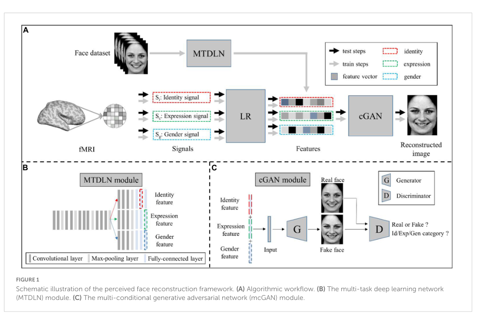

# MTDLN for fMRI Face Reconstruction

> 科研课堂复现：基于多属性约束的 fMRI 感知人脸重建框架复现。  
> 本仓库主要整理并复现论文中的 **MTDLN 多任务特征提取模块** 与 **mcGAN 多条件生成模块**，用于理解从面部图像特征、脑区 fMRI 信号到人脸重建的整体流程。

## 项目背景

人脸感知重建是脑解码和脑机接口中的一个典型跨模态任务。相较于普通物体，人脸图像不仅包含低层视觉信息，还同时包含身份、表情、性别等高层属性。论文提出的框架将这些多属性信息显式建模，并结合多个面孔选择性脑区的 fMRI 信号，实现从脑活动到感知人脸图像的重建。

本项目是课堂科研训练中的代码复现与模块理解工作，重点不在于提出新的模型，而在于复现并拆解原文方法中的关键深度学习模块。

## 方法框架


该图展示了论文中的整体重建流程，包括 MTDLN、LR 和 mcGAN 三个核心模块。

整体流程可以概括为：

1. **MTDLN：多任务深度学习网络**  
   输入单张人脸图像，同时学习身份、表情和性别三个任务，用于提取多维人脸属性特征。

2. **LR：线性回归映射模块**  
   建立多个面孔选择性脑区 fMRI 信号与人脸属性特征之间的映射关系。不同属性对应不同脑区组合，例如身份、表情和性别分别使用不同的 ROI 信号。

3. **mcGAN：多条件生成对抗网络**  
   将预测得到的身份、表情和性别特征作为条件输入，通过生成器重建人脸图像，并通过带多属性判别分支的判别器约束生成结果。

## 仓库结构

```text
MTDLN-for-f-mri-reconstruction-main/
├── MTDLN/
│   ├── keras_vggface/        # VGGFace 相关模型与工具函数
│   ├── models-sin/           # 单任务网络结构：expression / identity / gender
│   ├── models-tri/           # 多任务网络结构，不同共享层划分方案
│   ├── train/                # MTDLN 训练脚本
│   └── test/                 # 表情、身份、性别任务测试脚本
├── mcGAN/
│   ├── mcGAN_model.py        # Generator 与 Discriminator 定义
│   ├── mcGAN_dataloader.py   # 读取人脸图像和属性特征向量
│   ├── mcGAN_train.py        # mcGAN 训练脚本
│   └── mcGAN_test.py         # 生成与测试脚本
├── docs/
│   └── images/
│       └── framework_figure1.png
└── README.md
```


### 1. MTDLN 多任务特征提取

论文使用 VGG-Face 作为基础网络，并将网络后部拆分为三个分支，分别对应：

- facial expression classification
- facial identity classification
- gender classification

仓库中的 `MTDLN/models-tri/` 包含多种三分支结构，用于对应论文中不同共享层划分方案；`MTDLN/train/train.py` 是训练多任务网络的主脚本。

当前代码中主要参数包括：

```python
nb_class1 = 7      # 表情类别数
nb_class2 = 107    # 身份类别数
nb_class3 = 2      # 性别类别数
hidden_dim = 512
img_w = 224
img_h = 224
batchsize = 32
epochs = 500
weight1 = 0.4
weight2 = 0.3
weight3 = 0.3
```

其中 `weight1:weight2:weight3 = 0.4:0.3:0.3` 对应表情、身份和性别三个任务的损失权重。

### 2. mcGAN 多条件人脸生成

`mcGAN/` 目录实现了论文中的多条件生成对抗网络。其核心思想是将 MTDLN 提取的三类属性特征拼接后作为生成器输入：

```text
identity feature + expression feature + gender feature → Generator → reconstructed face
```

判别器不仅判断图像真伪，还额外输出身份、表情和性别分支，从而让生成图像受到多属性约束。

`mcGAN_model.py` 中的主要结构包括：

- `Generator`：输入特征向量，输出灰度人脸图像；
- `Discriminator`：同时输出 real/fake、identity、expression、gender 四类判断；
- `get_GAN()`：初始化生成器与判别器。


## 环境依赖

本项目同时包含 Keras/TensorFlow 与 PyTorch 代码，建议使用较老版本的 Python 环境复现。

建议环境：

```text
Python 3.7
TensorFlow / Keras
keras-vggface
PyTorch
torchvision
numpy
pandas
opencv-python
scikit-learn
Pillow
matplotlib
tensorboard
```

示例安装：

```bash
pip install numpy pandas opencv-python pillow matplotlib scikit-learn
pip install torch torchvision
pip install keras tensorflow keras-vggface
```

不同机器上的 TensorFlow、Keras 和 `keras-vggface` 版本兼容性可能不同。如果出现 `keras.engine`、`fit_generator` 或 `ModelCheckpoint(period=...)` 相关报错，通常是因为 Keras 版本过新，需要改代码或降低版本。

## 数据准备

### MTDLN 训练数据

`MTDLN/train/train.py` 需要一个包含图像路径和多任务标签的表格，例如：

| path | emo | id | gender |
|---|---|---|---|
| image_001.jpg | happy | subject_001 | male |
| image_002.jpg | neutral | subject_002 | female |

代码会将 `emo`、`id` 和 `gender` 三列编码为 one-hot 标签，并通过 `flow_from_dataframe()` 读取图像。

### mcGAN 训练数据

`mcGAN_dataloader.py` 默认读取：

```text
image_root/       # 人脸图像
id_label_root/    # 身份特征 .npy
emo_label_root/   # 表情特征 .npy
gen_label_root/   # 性别特征 .npy
```

其中三类属性特征通常来自 MTDLN 的中间层输出。读取后会进行拼接，作为生成器的条件输入。

## 运行方式

### 1. 训练 MTDLN

先修改 `MTDLN/train/train.py` 中的日志路径、数据路径和模型保存路径，然后运行：

```bash
cd MTDLN/train
python train.py
```

训练完成后会保存：

- 模型结构 `.json`
- 模型权重 `.h5` / `.hdf5`
- 训练 accuracy / loss 记录

### 2. 测试 MTDLN 分支任务

```bash
cd MTDLN/test
python test_exp.py
python test_id.py
python test_gen.py
```

其中身份识别测试脚本使用图像对距离与交叉验证方式计算 accuracy。

### 3. 训练 mcGAN

先修改 `mcGAN_train.py` 中的数据路径、TensorBoard 路径、生成图像保存路径和模型保存路径，然后运行：

```bash
cd mcGAN
python mcGAN_train.py --num_epochs 2000 --batch_size 16 --lr1 2e-4
```

训练过程中会保存生成样例图和生成器权重。


